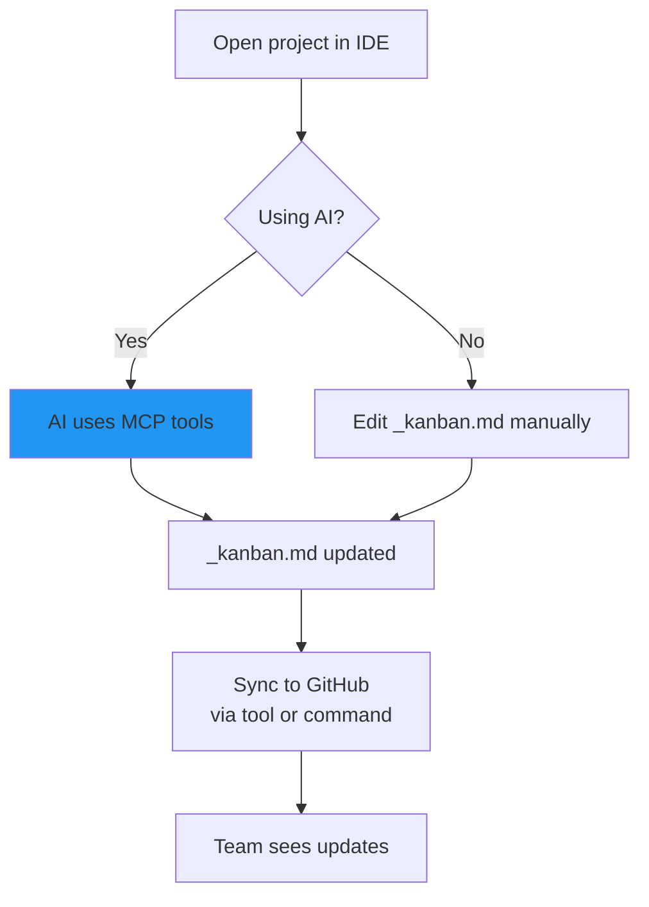

# Kanbanger 🎯

**MCP-First Task Management** - Let AI manage your kanban board, sync to GitHub Projects V2

Built with the same `${workspaceFolder}` pattern as [fckgit](https://github.com/earlyprototype/fckgit) and [timepon](https://github.com/earlyprototype/thought_bubble)

## What is Kanbanger?

Kanbanger is an **MCP (Model Context Protocol) server** that gives AI assistants structured tools to manage your tasks. Your kanban board lives in markdown (`_kanban.md`) and automatically syncs to GitHub Projects.

**Key Benefit**: AI can directly add, move, and sync tasks without you touching files or running commands.

## Quick Start


### 1. Install

```bash
git clone https://github.com/earlyprototype/kanbanger.git
cd kanbanger
pip install -e ".[mcp]"
```

### 2. Run Setup Wizard

```bash
kanban-sync-setup
```

The wizard walks you through:
1. GitHub token setup
2. Repository connection
3. Project selection
4. **MCP server configuration** (recommended!)

### 3. Restart Your IDE

Close and reopen Cursor (or your IDE) to load the MCP server.

### 4. Use It!

**With AI (MCP mode):**
```
You: "Add a task to implement user auth to the TODO column"
AI: [Calls add_task tool] ✅ Task added!

You: "Move that task to DOING"
AI: [Calls move_task tool] ✅ Task moved!

You: "Sync to GitHub"
AI: [Calls sync_to_github tool] ✅ Synced!
```

**Manual mode (still works!):**
```bash
# Edit _kanban.md manually, then:
kanban-sync _kanban.md
```

## How It Works

### MCP Integration (Recommended)

Your AI assistant gets these **tools**:
- `add_task(title, column, description)` - Add tasks
- `move_task(title, from, to)` - Move between columns
- `delete_task(title, column)` - Remove tasks
- `list_tasks(column?)` - View tasks
- `sync_to_github(dry_run)` - Push to GitHub
- `get_sync_status()` - Check sync state

And these **resources** (always visible):
- `kanban://current-board` - Live board state
- `kanban://stats` - Task counts
- `kanban://sync-status` - GitHub sync info

Plus **context prompts**:
- `kanban_awareness` - Reminds AI about board
- `task_planning` - Helps break down goals
- `daily_standup` - Morning review
- `github_sync_check` - Sync reminders

### The Workflow



## Kanban Board Format

Create `_kanban.md` in your project root:

```markdown
# Project Kanban

## BACKLOG
*   [ ] Future feature ideas
*   [ ] Nice-to-have improvements

## TODO
*   [ ] Ready to start
*   [ ] Prioritized tasks

## DOING
*   [ ] Currently active work

## DONE
*   [x] Completed tasks
*   [x] Finished features
```

**That's it!** No special syntax, just markdown.

## Configuration

### Per-Project Setup (Automatic)

The setup wizard creates `.cursor/mcp.json`:

```json
{
    "mcpServers": {
        "kanbanger": {
            "command": "python",
            "args": ["-m", "kanbanger_mcp"],
            "env": {
                "KANBANGER_WORKSPACE": "${workspaceFolder}",
                "GITHUB_TOKEN": "${env:GITHUB_TOKEN}",
                "GITHUB_REPO": "${env:GITHUB_REPO}",
                "GITHUB_PROJECT_NUMBER": "${env:GITHUB_PROJECT_NUMBER}"
            }
        }
    }
}
```

**Key Features:**
- `${workspaceFolder}` - Automatically resolves to your project path
- `${env:VAR}` - Loads from environment (secrets stay in `.env`)
- **Portable** - Same config works on any machine
- **Per-project** - Each workspace independent

### Environment Variables

Create `.env` in your project (wizard does this):

```env
GITHUB_TOKEN=your_token_here
GITHUB_REPO=owner/repo
GITHUB_PROJECT_NUMBER=6  # optional, auto-detects
```

**Get GitHub Token:**
1. GitHub Settings → Developer Settings → Personal Access Tokens
2. Generate new token (classic)
3. Required scopes: `repo`, `project`, `read:org`

## Commands

| Command | Purpose |
|---------|---------|
| `kanban-sync-setup` | Run interactive setup wizard |
| `kanban-sync _kanban.md --dry-run` | Preview changes (safe) |
| `kanban-sync _kanban.md` | Sync to GitHub |
| `python -m kanbanger_mcp --help` | MCP server options |

**Or just ask your AI!**
- "Add task X to TODO"
- "Move task Y to DOING"
- "Sync to GitHub"

## Why MCP-First?

### Traditional Approach (Fragile)
```
User: "Add a task"
AI: *Reads _kanban.md*
AI: *Edits file with search/replace*
AI: *Runs terminal command*
AI: *Hopes nothing broke*
```

### MCP Approach (Robust)
```
User: "Add a task"
AI: add_task("Task name", "TODO") ✅
```

**Benefits:**
- ✅ Type-safe, validated operations
- ✅ AI always aware of board state (resources)
- ✅ Context injected automatically (prompts)
- ✅ Works across all AI clients (Cursor, Claude, etc.)
- ✅ No parsing errors or file corruption

## Multiple Projects

Each project gets its own MCP server:

```
ProjectA/
├── .cursor/mcp.json  # Uses ${workspaceFolder}
├── _kanban.md
└── .env

ProjectB/
├── .cursor/mcp.json  # Same config, different workspace!
├── _kanban.md
└── .env
```

**No path editing needed!** The `${workspaceFolder}` variable handles everything.

## Documentation

- **[MCP Setup Guide](MCP_SETUP.md)** - Detailed MCP configuration for Cursor, Claude Desktop, VS Code
- **[Setup Flow Diagram](docs/setup-flow.md)** - Visual guide
- **[LLM Guidance](LLM_GUIDANCE.md)** - How AI should use kanbanger
- **[Contributing](CONTRIBUTING.md)** - How to contribute

## Git Hooks (Optional Enforcement)

Want to ensure the board is always synced? Install git hooks:

```bash
cd git-hooks
./install-hooks.sh  # or install-hooks.ps1 on Windows
```

- **Pre-commit**: Checks board is synced before commit
- **Post-commit**: Auto-syncs after commit

## Troubleshooting

### MCP Tools Not Showing

1. **Check installation:**
```bash
pip show mcp-use
```

2. **Check config exists:**
```bash
ls .cursor/mcp.json
```

3. **Restart IDE** - Required after config changes

4. **Check IDE logs:**
   - Cursor: View → Output → Select "MCP"

### Sync Failures

1. **Verify credentials:**
```bash
# Check .env exists
cat .env

# Test token
curl -H "Authorization: token YOUR_TOKEN" https://api.github.com/user
```

2. **Check project exists:**
   - Go to your repo on GitHub
   - Verify Project is linked
   - Check Status field has: Backlog, Todo, InProgress, Done

### Wrong Workspace

If MCP server can't find `_kanban.md`:

1. **Use local config** - `.cursor/mcp.json` in project root (not global)
2. **Check workspace** - IDE opened correct folder?
3. **Restart IDE** - Reload configuration

## FAQ

**Q: Can I use CLI without MCP?**  
A: Yes! `kanban-sync _kanban.md` works standalone.

**Q: Does MCP work in other IDEs?**  
A: Yes! Cursor, Claude Desktop, VS Code (with extension), any MCP client.

**Q: What if I already use GitHub Projects?**  
A: Kanbanger syncs one-way: local → GitHub. Your project becomes a view of your markdown.

**Q: Can I use with multiple GitHub Projects?**  
A: Yes, different project per workspace. Each workspace configured independently.

**Q: Is PyPI available?**  
A: Not yet. We're focusing on API stability first. Use git installation for now.

## Examples

### AI Workflow
```
Morning:
You: "Show me daily standup prompt"
AI: [Shows standup review with current board state]

You: "Add task to implement OAuth to TODO"
AI: ✅ Added

You: "I'm starting work on OAuth"  
AI: ✅ Moved to DOING

Afternoon:
You: "OAuth is done"
AI: ✅ Moved to DONE

Evening:
You: "Sync everything to GitHub"
AI: ✅ Synced - 1 created, 1 updated
```

### Manual Workflow
```bash
# Edit _kanban.md in your editor
vim _kanban.md

# Preview changes
kanban-sync _kanban.md --dry-run

# Sync for real
kanban-sync _kanban.md
```

## Project Status

- ✅ MCP Server (v2.1.0)
- ✅ GitHub Projects V2 sync
- ✅ Interactive setup wizard
- ✅ Git hooks
- ✅ Cursor rules enforcement
- ✅ Distribution package
- 🔄 Bidirectional sync (planned)
- 🔄 Multiple kanban files (planned)
- 🔄 VS Code extension (planned)

## License

MIT - See [LICENSE](LICENSE)

## Contributing

Contributions welcome! See [CONTRIBUTING.md](CONTRIBUTING.md)

## Credits

Built with the Model Context Protocol (MCP) ecosystem. Inspired by the workspace-aware patterns in [fckgit](https://github.com/earlyprototype/fckgit).

---

**Made with ❤️ for developers who want AI-assisted task management without leaving their editor.**
