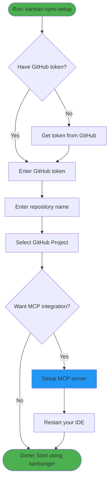
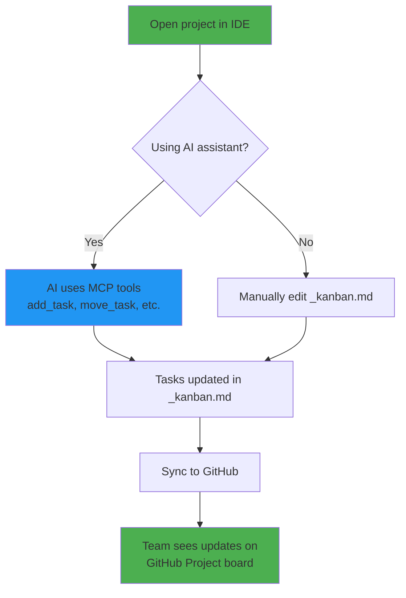

# Kanbanger Setup & Usage - Simple User Flow

## Getting Started

## Setup Wizard Flow

## Daily Usage

## Commands Cheat Sheet

| Step | Command | What it does |
|------|---------|-------------|
| **Setup** | `kanban-sync-setup` | Interactive wizard - do this first |
| **Preview** | `kanban-sync _kanban.md --dry-run` | See what would change (safe) |
| **Sync** | `kanban-sync _kanban.md` | Push changes to GitHub |
| **MCP** | AI: "Add task to TODO" | AI assistant does it for you |

That's it! 🎉
