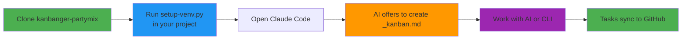
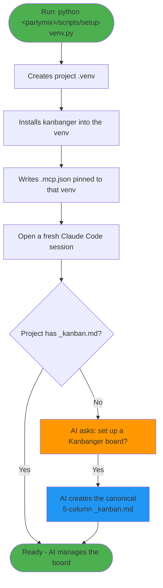
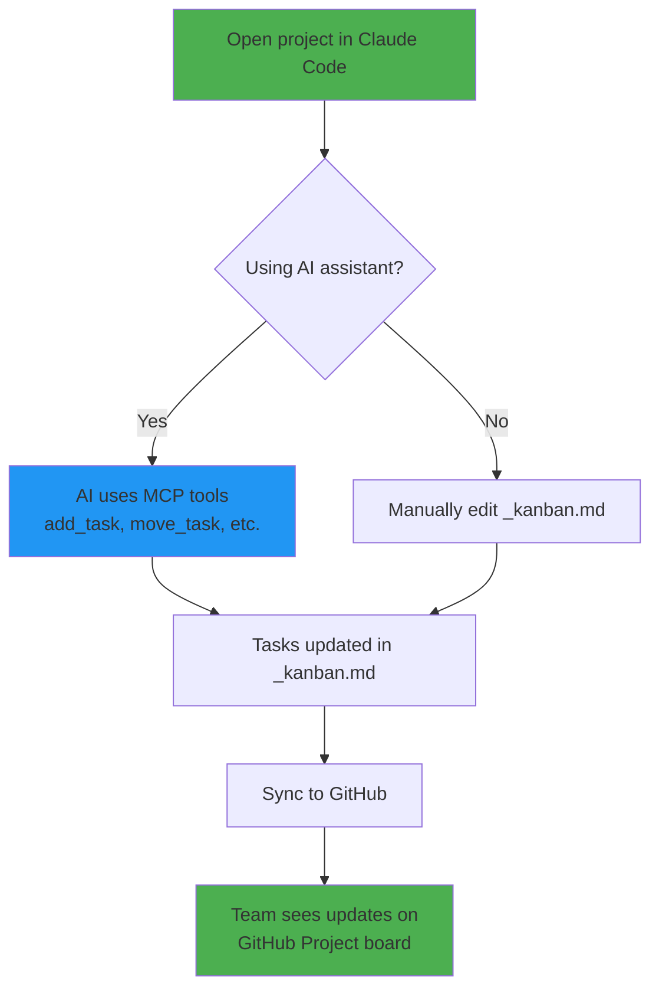

# Kanbanger Setup & Usage - Simple User Flow

## Getting Started

```mermaid
graph LR
    A[Clone kanbanger-partymix] --> B[Run setup-venv.py<br/>in your project]
    B --> C[Open Claude Code]
    C --> D[AI offers to create _kanban.md]
    D --> E[Work with AI or CLI]
    E --> F[Tasks sync to GitHub]

    style A fill:#4CAF50
    style B fill:#2196F3
    style D fill:#FF9800
    style E fill:#9C27B0
    style F fill:#4CAF50
```

## Setup Flow

```mermaid
graph TD
    Start([Run: python &lt;partymix&gt;/scripts/setup-venv.py]) --> Step1[Creates project .venv]
    Step1 --> Step2[Installs kanbanger into the venv]
    Step2 --> Step3[Writes .mcp.json pinned to that venv]
    Step3 --> Restart[Open a fresh Claude Code session]

    Restart --> Board{Project has _kanban.md?}
    Board -->|Yes| Ready([Ready - AI manages the board])
    Board -->|No| Ask[AI asks: set up a Kanbanger board?]
    Ask -->|Yes| Create[AI creates the canonical<br/>5-column _kanban.md]
    Create --> Ready

    style Start fill:#4CAF50
    style Ready fill:#4CAF50
    style Ask fill:#FF9800
    style Create fill:#2196F3
```

See **[INSTALL.md](../INSTALL.md)** for the authoritative install steps,
credentials setup, and troubleshooting.

## Daily Usage

```mermaid
graph TD
    Open[Open project in Claude Code] --> AI{Using AI assistant?}

    AI -->|Yes| MCP[AI uses MCP tools<br/>add_task, move_task, etc.]
    AI -->|No| Manual[Manually edit _kanban.md]

    MCP --> Tasks[Tasks updated in _kanban.md]
    Manual --> Tasks

    Tasks --> Sync[Sync to GitHub]
    Sync --> Team[Team sees updates on<br/>GitHub Project board]

    style Open fill:#4CAF50
    style MCP fill:#2196F3
    style Team fill:#4CAF50
```

## Commands Cheat Sheet

| Step | Command | What it does |
|------|---------|-------------|
| **Setup** | `python <partymix>/scripts/setup-venv.py` | Provision a project's venv + `.mcp.json` (do this first) |
| **Diagnose** | `kanban-doctor` | Preflight check of a project's install |
| **Preview** | `kanban-sync _kanban.md --dry-run` | See what would change (safe) |
| **Sync** | `kanban-sync _kanban.md` | Push changes to GitHub |
| **MCP** | AI: "Add task to TODO" | AI assistant does it for you |

That's it! 🎉
